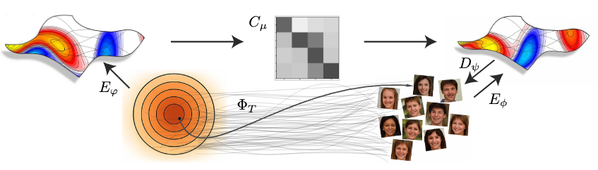
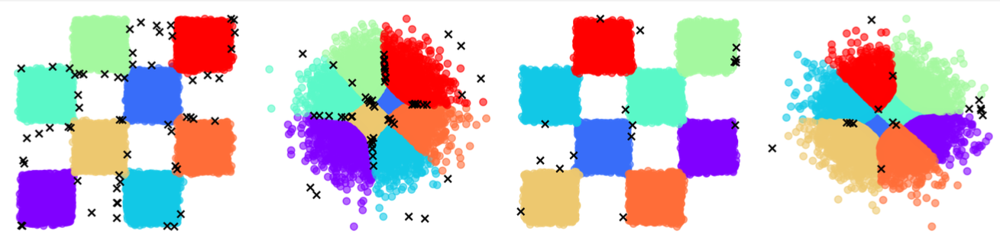

# One-Step Offline Distillation of Diffusion-based Models via Koopman Modeling

This repository contains the official implementation of our paper on Koopman-based distillation models for efficient one-step diffusion-based distillation in offline setup.
[Link to the paper.](https://arxiv.org/abs/2505.13358) [Link to the project page.](http://sites.google.com/view/koopman-distillation-model/home)



---

## 🛠 Installation

Follow these steps to set up the environment:

### 1. Create a Conda Environment

Open your terminal and run:

```
conda create --name your_env_name python=3.9
conda activate your_env_name
```

> Replace `your_env_name` with your preferred environment name.

### 2. Install Dependencies

Navigate to the root directory of this repository and install the required Python packages:

```
pip install -r requirements.txt
```

### 3. Download Datasets

See the section below for instructions.

---

## 📁 Data and Artifacts

### Checkerboard Dataset

The checkerboard dataset is already included in the repository:

```
data/Checkerboard/sampled_dataset.npy
```

This file contains 50k samples from a flow-matching model. No need for additional actions.

### Cifar10 (Unconditional & Conditional), FFHQ and AFHQv2 Datasets

To use these datasets:

1. Download them from the following Google Drive folder:  
   [Dataset Drive Folder](https://drive.google.com/drive/u/1/folders/19u6696ItAkG2kTfjfa4w-RhEqFHnpfLf)

2. Unzip the downloaded file.

3. Update the corresponding config file with the correct path.  
   For example, for unconditional CIFAR-10, edit the config file:

   ```
   configs/koopman/cifar_uncond.py
   ```

   and set the correct data path foldr:

   ```python
   data_path='<your_data_path>/cifar10_uncond_train_data'
   ```
   or either just add it as a command line argument later on.

### Optional: Test Data for Unconditional CIFAR-10

We also provide 1000 additional EDM-generated samples (not used during training) for overfitting and debugging checks. You can find it in the Drive folder 
, download and unzip it and then, and you can set in the config file under the name `datapath_test`.

---
### Artifacts

1. Model outputs are saved to the path specified in the `output_prefix_path` argument.
2. Neptune logging is supported. By default, basic console logging is enabled.

---

## 🚀 Training, Evaluation, and Analysis

You're ready to go! Below are example commands for running training and evaluation.

### Checkerboard

#### Training

```
python train.py --config koopman/checkerboard_uncond
```

#### Analysis

To reproduce the noise structure and outlier analysis plots in the paper:

```
PYTHONPATH=. python experiments/checkerboard/analysis.py
```

---

### CIFAR-10 (Unconditional and Conditional), FFHQ and AFHQv2 

#### Training

To train the unconditional CIFAR-10 model:

```
python train.py --config koopman/cifar_uncond
```

To train the conditional CIFAR-10 model:
```
python train.py --config koopman/cifar_cond
```

To train the unconditional FFHQ model:
```
python train.py --config koopman/ffhq_uncond
```

To train the unconditional AFHQv2 model:
```
python train.py --config koopman/afhq_uncond
```

#### Decomposed Matrix Version
We enable a decomposed implementation  of the koopman matrix. Please see our paper appendix for more details
or follow the code. To use decomposed koopman matrix, please run the following config file:
```
python train.py --config koopman/cifar_uncond_decomposed
```

--- 

### Evaluation
---

#### CIFAR-10 Evaluation (Unconditional and Conditional), FFHQ and AFHQv2

To run evaluation:

1. Download the files `cifar10-32x32.npy`,  `ffhq-64x64.npz`, `afhqv2-64x64.npz` from the datasets drive. Store them.
2. Open the file `fid.py`.
3. Set the path to the directory that contains the downloaded files in the following line:
   ```
   base_path = '<path_to_ref_file_direcotry>'
   ```
   
---

### Analysis
To run the checkerboard latent structure and outlier analysis, execute the following command:
```   
python experiments/checkerboard/noise_structure_and_outliers_analysis.py
```
A pretrained model and the required data are included in the repository, 
so the script runs automatically without any additional setup.



---

# Citation
``` 
@misc{berman2025onestepofflinedistillationdiffusionbased,
      title={One-Step Offline Distillation of Diffusion-based Models via Koopman Modeling}, 
      author={Nimrod Berman and Ilan Naiman and Moshe Eliasof and Hedi Zisling and Omri Azencot},
      year={2025},
      eprint={2505.13358},
      archivePrefix={arXiv},
      primaryClass={cs.LG},
      url={https://arxiv.org/abs/2505.13358}, 
}
``` 
